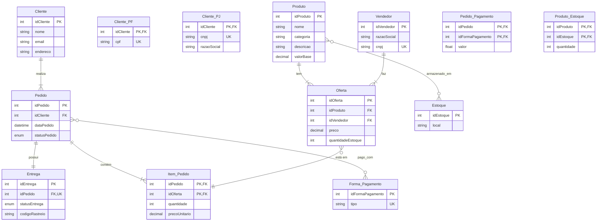

# Projeto de Banco de Dados para E-commerce

## 🎯 Visão Geral
Este documento detalha o projeto de um banco de dados para uma plataforma de e-commerce. O modelo foi desenhado para ser flexível e escalável, suportando operações essenciais como cadastro de clientes (Pessoa Física e Jurídica), gerenciamento de produtos de múltiplos vendedores, processamento de pedidos, pagamentos e entregas.

O projeto é apresentado em três partes:

- **Narrativa e Regras de Negócio**: Descreve o funcionamento do sistema em linguagem natural.
- **Modelo EER (Diagrama)**: Apresenta a estrutura visual das entidades e seus relacionamentos.
- **Scripts SQL**: Fornece o código para criar o esquema (DDL), popular com dados de teste (DML) e realizar consultas complexas.

---

## 📖 Narrativa e Regras de Negócio
### Cliente
Um usuário pode se cadastrar como **Pessoa Física (PF)**, fornecendo seu CPF, ou como **Pessoa Jurídica (PJ)**, fornecendo seu CNPJ e Razão Social. Um cliente não pode ser PF e PJ ao mesmo tempo. Cada cliente possui um endereço principal, mas pode cadastrar múltiplos endereços para entrega. Um cliente pode realizar vários pedidos ao longo do tempo.

### Produto e Estoque
A plataforma possui um catálogo central de **Produtos**. Cada produto possui atributos como nome, descrição e categoria. Um mesmo produto pode ser armazenado em diferentes locais de **Estoque** (centros de distribuição), com quantidades específicas em cada um.

### Vendedores e Fornecedores
Os produtos podem ser vendidos pela própria plataforma ou por **Vendedores Terceiros**. Cada vendedor cria uma **Oferta** para um produto existente no catálogo, definindo seu próprio preço e a quantidade que possui em estoque. Um produto pode, portanto, ter várias ofertas de diferentes vendedores. A plataforma também gerencia **Fornecedores**, que são as entidades que abastecem o estoque (seja da própria plataforma ou dos vendedores).

### Pedido
Quando um cliente realiza uma compra, um **Pedido** é gerado. Um pedido é composto por um ou mais itens, onde cada item corresponde a uma **Oferta** de um produto específico. O pedido consolida informações do cliente, endereço de entrega e status geral.

### Pagamento
Um único pedido pode ser pago utilizando **múltiplas formas de pagamento** (ex: parte no cartão de crédito, parte com saldo em conta). O sistema deve registrar o valor pago em cada modalidade. As formas de pagamento disponíveis são pré-definidas (Cartão de Crédito, Boleto, Pix).

### Entrega
Cada pedido possui uma única **Entrega** associada. A entrega tem um status (ex: "Preparando", "Em trânsito", "Entregue") e um código de rastreio para acompanhamento pelo cliente.

---

## 🖼️ Diagrama do Modelo EER



---

## 🏗️ Esquema Lógico (Resumo)
- **Cliente**: Entidade principal com um atributo `tipo` para discriminar entre PF e PJ.
    - **Especializações**: `Cliente_PF` (com CPF) e `Cliente_PJ` (com CNPJ, RazaoSocial).
- **Produto**: Catálogo central de produtos.
- **Estoque**: Locais físicos de armazenamento.
- **Produto_Estoque**: Tabela associativa que indica a quantidade de um produto em um determinado estoque.
- **Vendedor**: Vendedores terceirizados (sellers).
- **Oferta**: Tabela associativa que representa um produto sendo vendido por um vendedor a um preço específico.
- **Pedido**: Agrupa os itens comprados por um cliente.
- **Item_Pedido**: Tabela associativa que detalha quais ofertas (produtos de vendedores) estão em um pedido.
- **Entrega**: Gerencia o status e o rastreio do envio de um pedido.
- **Forma_Pagamento**: Tabela de domínio com os tipos de pagamento (Pix, Boleto, etc.).
- **Pedido_Pagamento**: Tabela associativa que permite que um pedido tenha múltiplas formas de pagamento.

---

## 🧩 Script SQL — Criação do Schema (DDL)
```sql
DROP DATABASE IF EXISTS meu_ecommerce;
CREATE DATABASE meu_ecommerce;
USE meu_ecommerce;

-- Entidade Cliente com especialização
CREATE TABLE Cliente (
    idCliente INT PRIMARY KEY AUTO_INCREMENT,
    nome VARCHAR(100) NOT NULL,
    email VARCHAR(100) NOT NULL UNIQUE,
    endereco VARCHAR(255) NOT NULL
);

CREATE TABLE Cliente_PF (
    idCliente INT PRIMARY KEY,
    cpf CHAR(11) NOT NULL UNIQUE,
    FOREIGN KEY (idCliente) REFERENCES Cliente(idCliente) ON DELETE CASCADE
);

CREATE TABLE Cliente_PJ (
    idCliente INT PRIMARY KEY,
    cnpj CHAR(14) NOT NULL UNIQUE,
    razaoSocial VARCHAR(100) NOT NULL,
    FOREIGN KEY (idCliente) REFERENCES Cliente(idCliente) ON DELETE CASCADE
);

-- Produto e Estoque
CREATE TABLE Produto (
    idProduto INT PRIMARY KEY AUTO_INCREMENT,
    nome VARCHAR(100) NOT NULL,
    categoria VARCHAR(50),
    descricao TEXT,
    valorBase DECIMAL(10, 2) NOT NULL CHECK (valorBase > 0)
);

CREATE TABLE Estoque (
    idEstoque INT PRIMARY KEY AUTO_INCREMENT,
    local VARCHAR(100) NOT NULL
);

CREATE TABLE Produto_Estoque (
    idProduto INT,
    idEstoque INT,
    quantidade INT NOT NULL DEFAULT 0,
    PRIMARY KEY (idProduto, idEstoque),
    FOREIGN KEY (idProduto) REFERENCES Produto(idProduto),
    FOREIGN KEY (idEstoque) REFERENCES Estoque(idEstoque)
);

-- Vendedores e Fornecedores
CREATE TABLE Vendedor (
    idVendedor INT PRIMARY KEY AUTO_INCREMENT,
    razaoSocial VARCHAR(100) NOT NULL,
    cnpj CHAR(14) UNIQUE,
    localizacao VARCHAR(100)
);

-- Oferta representa um Produto sendo vendido por um Vendedor
CREATE TABLE Oferta (
    idOferta INT PRIMARY KEY AUTO_INCREMENT,
    idProduto INT,
    idVendedor INT,
    preco DECIMAL(10, 2) NOT NULL,
    quantidadeEstoque INT NOT NULL DEFAULT 0,
    UNIQUE(idProduto, idVendedor),
    FOREIGN KEY (idProduto) REFERENCES Produto(idProduto),
    FOREIGN KEY (idVendedor) REFERENCES Vendedor(idVendedor)
);

-- Pedido e seus componentes
CREATE TABLE Pedido (
    idPedido INT PRIMARY KEY AUTO_INCREMENT,
    idCliente INT,
    dataPedido DATETIME DEFAULT CURRENT_TIMESTAMP,
    statusPedido ENUM('Processando', 'Aprovado', 'Enviado', 'Entregue', 'Cancelado') NOT NULL DEFAULT 'Processando',
    FOREIGN KEY (idCliente) REFERENCES Cliente(idCliente)
);

CREATE TABLE Item_Pedido (
    idPedido INT,
    idOferta INT,
    quantidade INT NOT NULL,
    precoUnitario DECIMAL(10, 2) NOT NULL,
    PRIMARY KEY (idPedido, idOferta),
    FOREIGN KEY (idPedido) REFERENCES Pedido(idPedido),
    FOREIGN KEY (idOferta) REFERENCES Oferta(idOferta)
);

CREATE TABLE Entrega (
    idEntrega INT PRIMARY KEY AUTO_INCREMENT,
    idPedido INT NOT NULL UNIQUE,
    statusEntrega ENUM('Preparando', 'Em trânsito', 'Entregue', 'Falhou') NOT NULL DEFAULT 'Preparando',
    codigoRastreio VARCHAR(45) UNIQUE,
    dataPrevista DATE,
    FOREIGN KEY (idPedido) REFERENCES Pedido(idPedido)
);

-- Pagamento
CREATE TABLE Forma_Pagamento (
    idFormaPagamento INT PRIMARY KEY AUTO_INCREMENT,
    tipo VARCHAR(45) NOT NULL UNIQUE -- Ex: 'Cartão de Crédito', 'Boleto', 'Pix'
);

CREATE TABLE Pedido_Pagamento (
    idPedido INT,
    idFormaPagamento INT,
    valor FLOAT NOT NULL,
    PRIMARY KEY (idPedido, idFormaPagamento),
    FOREIGN KEY (idPedido) REFERENCES Pedido(idPedido),
    FOREIGN KEY (idFormaPagamento) REFERENCES Forma_Pagamento(idFormaPagamento)
);

-- Índices para otimização
CREATE INDEX idx_produto_nome ON Produto(nome);
CREATE INDEX idx_pedido_status ON Pedido(statusPedido);

```
